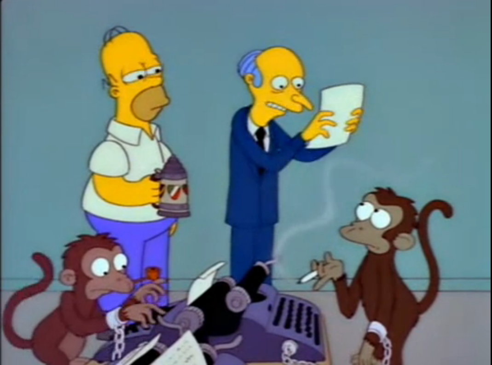

# Can computers make art?

Or more specifically...

> Can computer algorithms generate art?

Of course! We could argue that computers don't know (yet) they have generated something worthy of being considered  art. 

<!-- Computer programs lack self-awareness (at present), and for the sake of this workshop, they lack what is called *curation coefficient*: they don't know if what they generated is good. --> 

The question is **not whether** or not art can be made using algorithms, **but how**.

### The Infinite Monkey theorem

> Given enough time, a hypothetical monkey typing at **random** would, as part of its output, almost surely produce all of Shakespeare’s plays.

Let's not try this with real monkeys! Instead we can (quite easily) create a computer program that simulates the theorem's hypothetical monkey. We can instruct our algorithmic monkey to *play dice* and combine sets of symbols to compose words, words to make sentences and so on.

### Since we don't have enough time...

What's the likelihood of getting a meaningful sentence our of a completely random combination of words? It depends ... in any case it's *very* low.

How do we train our algorithmic monkey to hit meaningful sentences more often?

1. With statistical probability, ie: a [**Markov chain**](https://en.wikipedia.org/wiki/Markov_chain). We can feed the monkey with source material (eg: an article, a poem, or an entire book) and teach it to notice which words are more likely to follow each word in the source text. Then we can ask the monkey to build chains of words that are likely to follow each other. 

	Spam bots often use Markov chains to generate semi-sensical texts (see [Spam Poetry](http://www.spampoetry.org). A fascinating example of Markov chains used on social media is [What would I say?](http://what-would-i-say.com)
* Using a **generative grammar**, ie: a set of rules that can generate combinations of words which form grammatical sentences. 
	
	We  are familiar with the idea of *grammar* as a set of rules that define how we combine words in the languages we use to speak every day, so that other humans can understand us. 
	
	In a similar way, we can define a grammar for generative art. 
	
	In the most simple form, a generative grammar is made of a set of **structural rules**, which tell the computer how to put text together, and a set of **expansions**, which are options the computer can pick when generating text. 
	
	Today we're going to use [Tracery](http://www.crystalcodepalace.com/tracery.html), a language specifically written to help you write those generative grammar rules.
