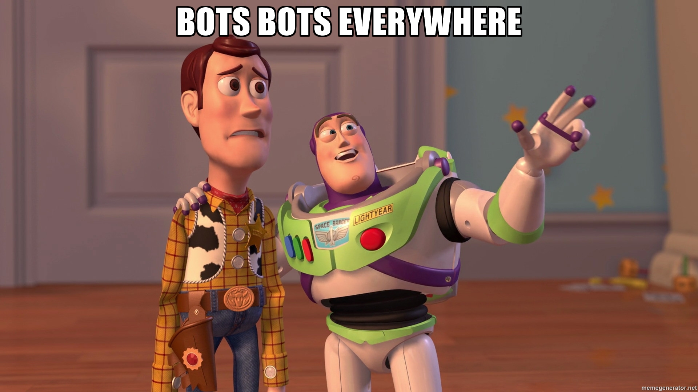
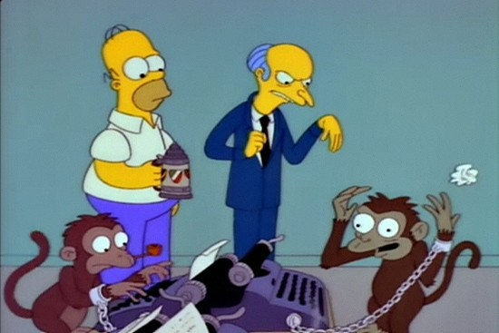
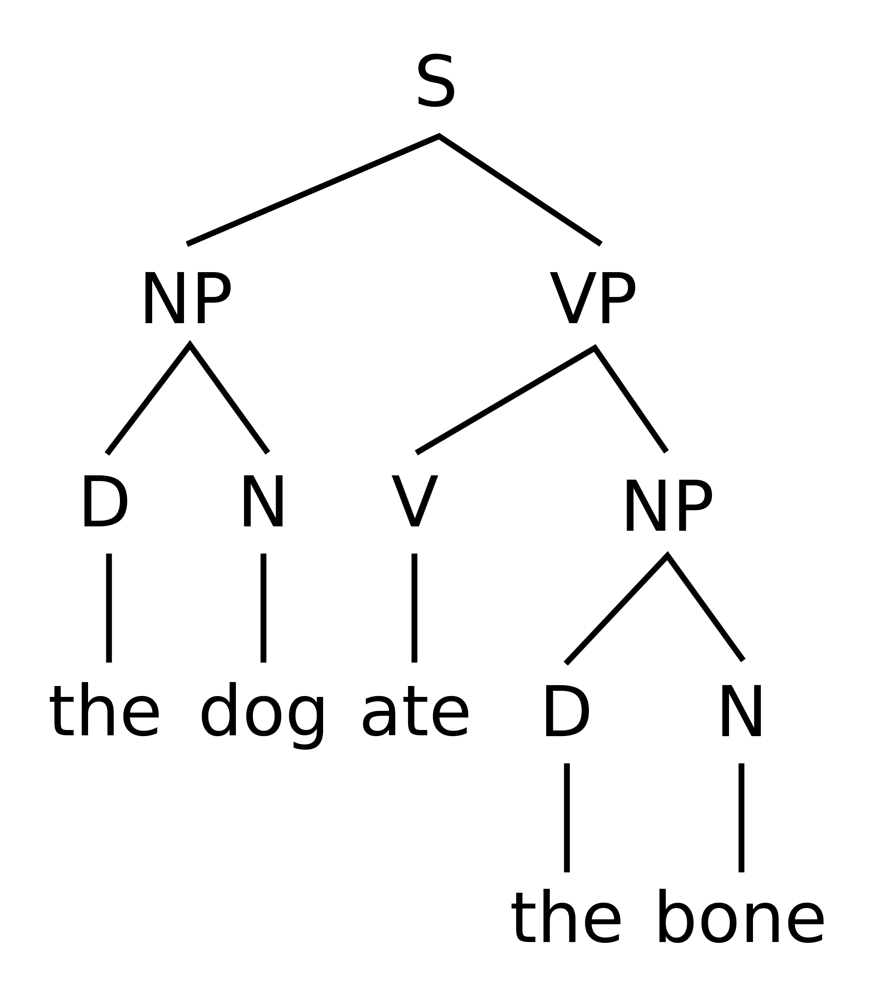
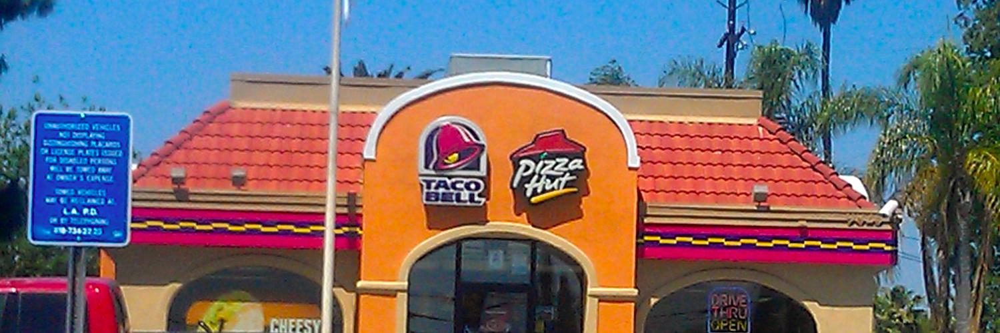
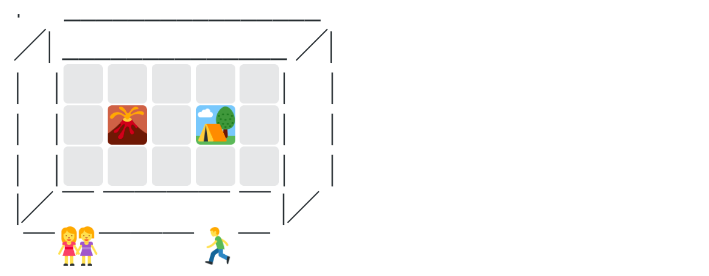

# Welcome!

Hands up :raising_hand: if you...

* made a bot before
* follow bots on Twitter
* are an artist
* are a coder

## Nice to meet you!

* Who are you?
* Why are you here?

### Why are we doing this?

2016 was [announced to be the year of bots](https://www.oreilly.com/ideas/why-2016-is-shaping-up-to-be-the-year-of-the-bot). As people move from social networks to messaging apps, companies increasingly hijack human conversations with *conversational interfaces*. There are weather bots, news bots, grocery bots, scheduling bots…



This is an opportunity for us to play with the language of bots, to develop a better understanding of how they work, and to think critically about their impact on our own language.


# Can bots make art?

Or more specifically...

> Can computer algorithms generate art?

Of course! We could argue that computers don't know (yet) they have generated something worthy of being considered art. 

<!-- Computer programs lack self-awareness (at present), and for the sake of this workshop, they lack what is called *curation coefficient*: they don't know if what they generated is good. --> 

The question is **not whether** or not art can be made using algorithms, **but how**.

### The Infinite Monkey theorem

> Given enough time, a hypothetical monkey typing at **random** would, as part of its output, almost surely produce all of Shakespeare’s plays.

[](https://www.youtube.com/watch?v=no_elVGGgW8)

Let's not try this with real monkeys! Instead we could (quite easily) create a computer program that simulates the theorem's hypothetical monkey. We could instruct our algorithmic monkey to *play dice* and combine sets of symbols to compose words, words to make sentences and so on.

### Since we don't have enough time...

What's the likelihood of getting a meaningful sentence out of a completely random combination of characters? It depends ... in any case it's *very* low.

How do we train our algorithmic monkey to hit meaningful sentences more often?

#### 1. Using probability

That is, using a [**Markov chain**](http://setosa.io/blog/2014/07/26/markov-chains/). 

There are two *states* in a Markov chain: what happens *now* and what can happen *next*. Each state has a probability associated with it. What happens next depends only on what happened now, not what happened two or three steps ago, even if there are multiple states.
  
Now back to the :monkey: we could feed it with **source material** (eg: an article, a poem, an entire book...) and teach it to notice which words are more likely to follow each word in the source text. Then we could ask the monkey to build chains of words: starting from one word (perhaps a random word, or one that is likely to appear at the beginning of sentences in the source text), then picking the *next* word at random from the ones that follow the current word in the source text. 

Spam bots often use Markov chains to generate semi-sensical texts (see [Spam Poetry](http://www.spampoetry.org)). Other fascinating examples of Markov chains used on social media are [What would I say?](http://what-would-i-say.com) and the [Trump bot](https://filiph.github.io/markov/).
	


#### 2. Using a *generative grammar*

That is, a set of rules that can generate combinations of words which form grammatical sentences. 
	
We are familiar with the idea of *grammar* as a set of rules that define how we combine words in the languages we use to speak every day, so that other humans can understand us. 
	

	
A generative grammar is based on the role that each word plays in a sentence, not on probability. This results in sentences that are generally more meaningful than those generated with Markov chains. 
	
People have used generative grammars to make things like the [Art Critique generator](http://www.pixmaven.com/phrase_generator.html), the [Artist Bio generator](http://500letters.org/form_15.php), the [Fifty Shades generator](http://www.fiftyshadesgenerator.com/) and many other *generators*.
	
A generative grammar is made of a set of **structural rules**, which tell the computer how to put things together, and a set of **expansions**, which are options the computer can pick when generating stuff. 
	
<!-- Why grammars instead of Markov chains? Because they tend to be easier to start with, and give you more control over the generated output -->


# Let's play a grammar!

To understand how a generative grammar works (and that it doesn't only apply to text) we'll use one to make drawings, together!

This activity is inspired by the work of conceptual artist [Sol LeWitt](https://www.moma.org/learn/moma_learning/themes/conceptual-art/sol-lewitt-and-instruction-based-art) and design collective [Conditional Design](https://www.conditionaldesign.org/).

> Pick a *random* marker, place your hand on a *random* point on the paper, draw a line to another *random* point.


Today we're using [Tracery](http://www.crystalcodepalace.com/tracery.html), a language specifically designed to help you write generative grammars.

How can we translate those generative drawing instructions from English to Tracery?

Let's start with the **structural rule**, aka `origin` 

```js
{
	"origin": ["Pick a #marker#, place your hand on a #point# on the paper, draw a line to another #point#."]
}
```

Notice how the English `random marker` becomes `#marker#`. That tells a computer carrying out the Tracery instructions to pick a random element from the `marker` **expansion**

```js
{
	"origin": ["Pick a #marker#, place your hand on a #point# on the paper, draw a line to another #point#."],
	"marker": ["red","blue","black","yellow","green","purple"],
	"point": ["0,1","1,1","0,0","0.1,0.2","0.5,0.6","0.3,0.7"]
}
```

<!--
> Fold the paper along two random points, pick a random marker, draw a line of random length on the fold.
> Pick a random hand, place it on a random point on the paper, trace the hand with a random marker 
-->	

	
# Let's reverse-engineer a grammar!	
	
Here are some bots built with Tracery. 

Scroll through their Twitter feeds and see if you can spot any **patterns** or **clues**. What might their grammars be like? 

[](https://twitter.com/CombinationBot)
[@CombinationBot](https://twitter.com/CombinationBot)	

[](https://twitter.com/bot_teleport)
[@bot_teleport](https://twitter.com/bot_teleport)
		
[](https://twitter.com/dataphors)
[@dataphors](https://twitter.com/dataphors)

[](https://twitter.com/autoflaneur)
[@autoflaneur](https://twitter.com/autoflaneur)

[](https://twitter.com/cryptbooks)
[@cryptbooks](https://twitter.com/cryptbooks)

[](https://twitter.com/tranquilbot)
[@tranquilbot](https://twitter.com/tranquilbot)

[](https://twitter.com/infinitedeserts)
[@infinitedeserts](https://twitter.com/infinitedeserts)

[](https://twitter.com/thetinygallery)
[@thetinygallery](https://twitter.com/thetinygallery)

[](https://twitter.com/hashfacade)
[@hashfacade](https://twitter.com/hashfacade)

[](https://twitter.com/softlandscapes)
[@softlandscapes](https://twitter.com/softlandscapes)

	
# Let's generate some ideas!

Do you have an idea for your generative Twitter bot?

If not, head to [bit.ly/bot-ideas-generator](https://matteomenapace.github.io/random-generator-generator/examples/bot-idea-generator/) to get some inspiration :bulb:

### Brain-swarm 

You may be familiar with *brainstorming*, but have you heard of [**brain-swarming**](http://blogs.hbr.org/2014/03/why-you-should-stop-brainstorming/) before?

> No study has proven that brainstorming works well, even though it has been the go-to method for **idea generation** since 1953.

In *brainstorming* you **talk** (and interrupt), whilst in *brainswarming* you **write**.

#### Your turn

1. Grab sharpies and post-its.
* Write down the inception of your Twitter bot idea on one post-it.
* Pass it around the room for everyone else to add to it, until it comes back to you!


# Let's make the bot!

We will use [CheapBotsDoneQuick](http://cheapbotsdonequick.com) by [@v21](https://github.com/v21), an amazing free tool that does the heavy lifting (Twitter API and such) so that you can focus on being creative with your grammar.

[](http://cheapbotsdonequick.com)

*With a little help from [this friend](https://matteomenapace.github.io/random-generator-generator) or [this friend](http://www.brightspiral.com/tracery)* :wrench:

<!-- http://air.decontextualize.com/tracery -->

Before time is over, we'll admire what you have produced and follow each other's bots! 
	
